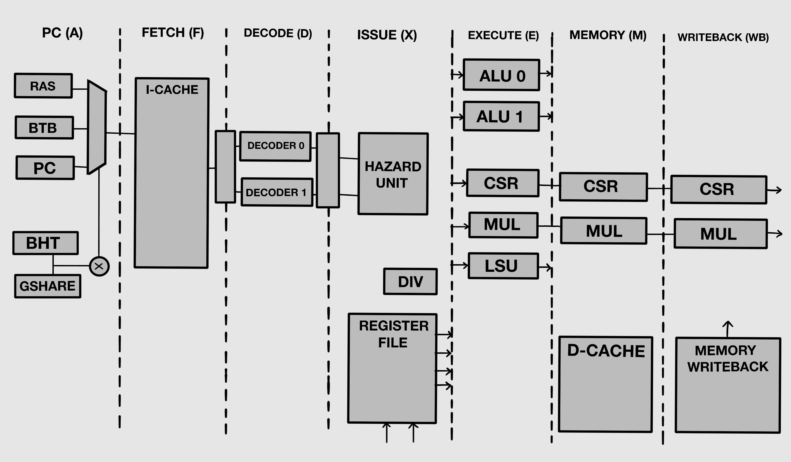

# 🚀 DualPipe-RV32IMZicsr
**PREVIOUS**: https://github.com/hilay020905/RISC_V_CORE

**DualPipe-RV32IMZicsr** is a high-performance, dual-issue, superscalar, in-order 32-bit RISC-V CPU core based on the RV32IMZicsr ISA. Designed for configurable branch prediction, CSR handling, and is fully synthesizable in Verilog-2001.

---

## 🧠 Project Overview

- 🧮 **Architecture**: Dual-issue, 6/7-stage in-order pipeline
- ⚙️ **ISA**: RV32IMZicsr (Integer, Multiply/Divide, CSR)
- 🚀 **Performance**:
  - 2 instructions per cycle max
- 🔁 **Pipeline**:
  - 64-bit instruction fetch
  - 32-bit data memory access
  - Dual ALUs + LSU + out-of-pipeline Divider
- 🧠 **Branch Prediction**:
  - Gshare or Bimodal Predictor (configurable)
  - Branch Target Buffer (BTB) + Return Address Stack (RAS)


---

## 📅 2-Week Development Plan

| **Date**   | **Day** | **Module / Task**       | **Description**                             |
| ---------- | ------: | ----------------------- | ------------------------------------------- |
| 2025-06-23 |   Day 1 | Architecture Planning   | Define pipeline layout, datapaths           |
| 2025-06-24 |   Day 2 | PC Logic                | Program Counter update & branch redirection |
| 2025-06-25 |   Day 3 | Instruction Fetch       | 64-bit fetch, memory alignment              |
| 2025-06-26 |   Day 4 | Decode + Register File  | Decode 2 instructions, reg read             |
| 2025-06-27 |   Day 5 | Issue Unit              | Hazard checks, resource arbitration         |
| 2025-06-28 |   Day 6 | ALUs (x2)               | Arithmetic, shift, comparison ops           |
| 2025-06-29 |   Day 7 | Branch + Predictor      | Gshare/Bimodal predictor, BTB, RAS          |
| 2025-06-30 |   Day 8 | Load/Store Unit         | LSU with alignment and byte masking         |
| 2025-07-01 |   Day 9 | Divider Unit            | Out-of-pipeline handshake divider           |
| 2025-07-02 |  Day 10 | CSR Unit                | Zicsr support: `mstatus`, `mtvec`, etc.     |
| 2025-07-03 |  Day 11 | MMU                     | SV32 MMU, TLB, `satp`, exception hooks      |
| 2025-07-04 |  Day 12 | Forwarding & Stalling   | Bypass network + inter-instr dependencies   |
| 2025-07-05 |  Day 13 | Testbenches (Verilator) | Unit/integration tests, waveforms           |

## DAY 1: Architecture Planning


---

## 🛠️ Build Instructions

### 🔧 Prerequisites
- iVerilog
- GTKWave


### 🔨 Build & Run

```bash
# Clone the repository
git clone https://github.com/hilay0200905/RV32IMZicsr.git
cd RV32IMZicsr
