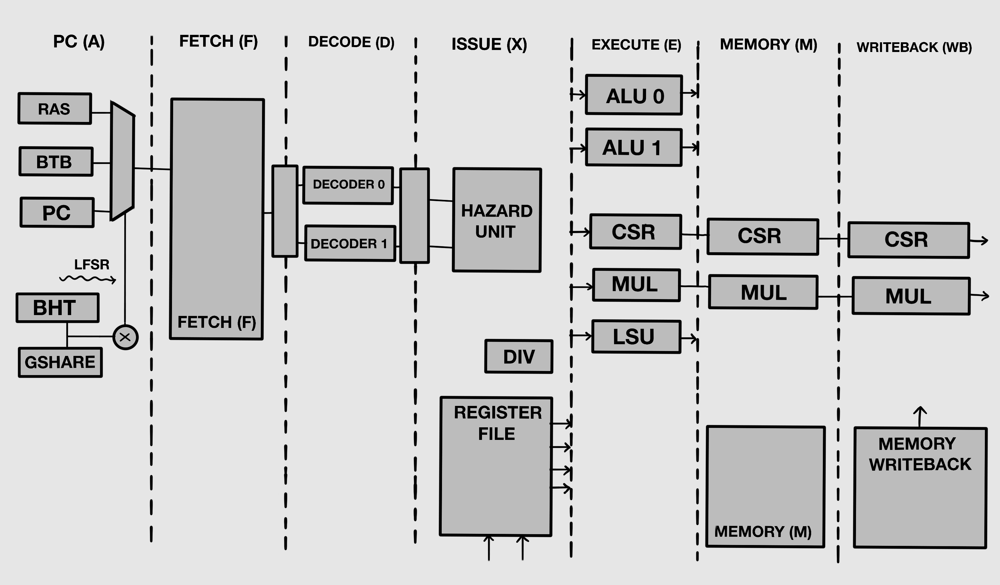

# 🚀 DualPipe-RV32IMZicsr
**PREVIOUS**: https://github.com/hilay020905/RISC_V_CORE

**DualPipe-RV32IMZicsr** is a high-performance, dual-issue, superscalar, in-order 32-bit RISC-V CPU core based on the RV32IMZicsr ISA. Designed for configurable branch prediction, CSR handling, and is fully synthesizable in Verilog-2001.

---

## 🧠 Project Overview

- 🧮 **Architecture**: Dual-issue, 6/7-stage in-order pipeline
- ⚙️ **ISA**: RV32IMZicsr (Integer, Multiply/Divide, CSR)
- 🚀 **Performance**:
  - 2 instructions per cycle max
- 🔁 **Pipeline**:
  - 64-bit instruction fetch
  - 32-bit data memory access
  - Dual ALUs + LSU + out-of-pipeline Divider
- 🧠 **Branch Prediction**:
  - Gshare or Bimodal Predictor (configurable)
  - Branch Target Buffer (BTB) + Return Address Stack (RAS)


---

# 📅 2-Week Development Plan

| **Date**   | **Day** | **Module / Task**       | 
| ---------- | ------: | ----------------------- | 
| 2025-06-23 |   Day 1 | Architecture Planning   | 
| 2025-06-24 |   Day 2 | NEXT PC Logic           | 
| 2025-06-25 |   Day 3 | Instruction Fetch       | 
| 2025-06-26 |   Day 4 | Decode + Register File  | 
| 2025-06-27 |   Day 5 | Issue Unit              |
| 2025-06-28 |   Day 6 | ALUs (x2)               |
| 2025-06-29 |   Day 7 | Branch + Predictor      | 
| 2025-06-30 |   Day 8 | Load/Store Unit         | 
| 2025-07-01 |   Day 9 | Divider Unit            | 
| 2025-07-02 |  Day 10 | CSR Unit                | 
| 2025-07-03 |  Day 11 | MMU                     | 
| 2025-07-04 |  Day 12 | Forwarding & Stalling   | 
| 2025-07-05 |  Day 13 | Testbenches (Verilator) | 

## DAY 1: Architecture Planning


# Microarchitecture
## DAY 2: NEXT PC LOGIC 

This module evaluates the **Next Program Counter (PC) Prediction** unit for a RISC-V CPU with branch prediction support using:

- **BTB** (Branch Target Buffer)
➤ Remembers where a branch instruction goes (target address).
➤ Used to predict the destination of jumps, calls, and branches.
- **BHT** (Branch History Table)
➤ Predicts whether a branch is taken or not taken.
➤ Uses past behavior to guide future predictions.
- **RAS** (Return Address Stack)
➤ Predicts return addresses for function returns (ret).
➤ Stores return PCs from call instructions in a stack-like structure.


| Test Case | Inputs Activated                                                 | Output PC (`next_pc_f_o`) | Prediction (`next_taken_f_o`) | Explanation                                                |
| --------- | ---------------------------------------------------------------- | ------------------------- | ----------------------------- | ---------------------------------------------------------- |
| 1         | None                                                             | `00001008`                | `00`                          | Sequential fetch (`pc + 8`), no BTB prediction.            |
| 2         | `branch_request_i`, `branch_is_taken_i`                          | Updates BTB               | `00`                          | Real branch taken, updates BTB for next predictions.       |
| 3         | `pc_accept_i`                                                    | `00002000`                | `01`                          | BTB predicts branch from Test 2, correct prediction.       |
| 4         | `branch_request_i`, `branch_is_call_i`                           | Updates RAS               | `01`                          | Function call, pushes return address to RAS.               |
| 5         | `branch_request_i`, `branch_is_ret_i`                            | `00002000`                | `01`                          | Return predicted using RAS stack (correctly).              |
| 6         | `branch_request_i`, `branch_is_not_taken_i`                      | Updates BHT               | `01`                          | Not-taken branch trains BHT to avoid future mispredict.    |
| 7         | `branch_request_i`, `branch_is_jmp_i`                            | Updates BTB               | `01`                          | Jump instruction predicted by BTB.                         |
| 8         | `invalidate_i` pulse                                             | `00002000`                | `01`                          | Prediction structures invalidated; no visible change.      |
| 9         | `branch_request_i`, `branch_is_taken_i`, `branch_is_not_taken_i` | `00002000`                | `01`                          | Simulates dual branch behavior (both taken and not taken). |
| 10        | None                                                             | `00002000`                | `01`                          | Idle, no new input activity.                               |


### 🔧 Prerequisites
- iVerilog
- GTKWave


### 🔨 Build & Run

```bash
# Clone the repository
git clone https://github.com/hilay0200905/RV32IMZicsr.git
cd RV32IMZicsr
