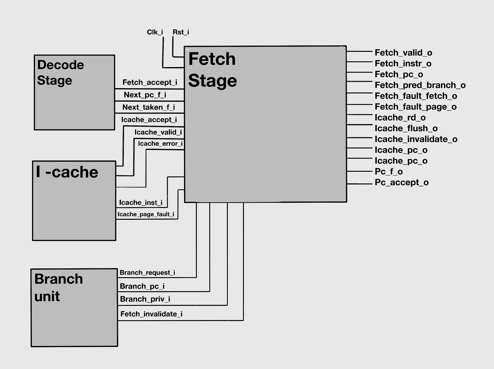

# 🚀 DUAL-CORE-RV32IMZicsr
**PREVIOUS**: https://github.com/hilay020905/RISC_V_CORE

**DUAL-CORE-RV32IMZicsr** is a high-performance, dual-issue, superscalar, in-order 32-bit RISC-V CPU core based on the RV32IMZicsr ISA. Designed for configurable branch prediction, CSR handling, and is fully synthesizable in Verilog-2001.

---

## 🧠 Project Overview

- 🧮 **Architecture**: Dual-issue, 7-stage in-order pipeline
- ⚙️ **ISA**: RV32IMZicsr (Integer, Multiply/Divide, CSR)
- 🚀 **Performance**:
  - 2 instructions per cycle max
- 🔁 **Pipeline**:
  - 64-bit instruction fetch
  - 32-bit data memory access
  - Dual ALUs + LSU + out-of-pipeline Divider
- 🧠 **Branch Prediction**:
  - Gshare or Bimodal Predictor (configurable)
  - Branch Target Buffer (BTB) + Return Address Stack (RAS)


---

# 📅 2-Week Development Plan

| **Date**   | **Day** | **Module / Task**       | 
| ---------- | ------: | ----------------------- | 
| 2025-06-23 |   Day 1 | Architecture Planning   | 
| 2025-06-24 |   Day 2 | NEXT PC Logic           | 
| 2025-06-25 |   Day 3 | Instruction Fetch       | 
| 2025-06-26 |   Day 4 | Decode + Register File  | 
| 2025-06-27 |   Day 5 | Issue Unit              |
| 2025-06-28 |   Day 6 | ALUs (x2)               |
| 2025-06-29 |   Day 7 | Branch + Predictor      | 
| 2025-06-30 |   Day 8 | Load/Store Unit         | 
| 2025-07-01 |   Day 9 | Divider Unit            | 
| 2025-07-02 |  Day 10 | CSR Unit                | 
| 2025-07-03 |  Day 11 | MMU                     | 
| 2025-07-04 |  Day 12 | Forwarding & Stalling   | 
| 2025-07-05 |  Day 13 | Testbenches (Verilator) | 

## DAY 1: Architecture Planning


# Microarchitecture
## DAY 2: NEXT PC LOGIC (Configurable with or without branch prediction)

This module evaluates the **Next Program Counter (PC) Prediction** unit for a RISC-V CPU with branch prediction support using:

- **BTB** (Branch Target Buffer) Remembers where a branch instruction goes (target address). Used to predict the destination of jumps, calls, and branches.
- **BHT** (Branch History Table) Predicts whether a branch is taken or not taken. Uses past behavior to guide future predictions.
- **RAS** (Return Address Stack) Predicts return addresses for function returns (ret). Stores return PCs from call instructions in a stack-like structure.


| Test Case | Inputs Activated                                                 | Output PC (`next_pc_f_o`) | Prediction (`next_taken_f_o`) | Explanation                                                |
| --------- | ---------------------------------------------------------------- | ------------------------- | ----------------------------- | ---------------------------------------------------------- |
| 1         | None                                                             | `00001008`                | `00`                          | Sequential fetch (`pc + 8`), no BTB prediction.            |
| 2         | `branch_request_i`, `branch_is_taken_i`                          | Updates BTB               | `00`                          | Real branch taken, updates BTB for next predictions.       |
| 3         | `pc_accept_i`                                                    | `00002000`                | `01`                          | BTB predicts branch from Test 2, correct prediction.       |
| 4         | `branch_request_i`, `branch_is_call_i`                           | Updates RAS               | `01`                          | Function call, pushes return address to RAS.               |
| 5         | `branch_request_i`, `branch_is_ret_i`                            | `00002000`                | `01`                          | Return predicted using RAS stack (correctly).              |
| 6         | `branch_request_i`, `branch_is_not_taken_i`                      | Updates BHT               | `01`                          | Not-taken branch trains BHT to avoid future mispredict.    |
| 7         | `branch_request_i`, `branch_is_jmp_i`                            | Updates BTB               | `01`                          | Jump instruction predicted by BTB.                         |
| 8         | `invalidate_i` pulse                                             | `00002000`                | `01`                          | Prediction structures invalidated; no visible change.      |
| 9         | `branch_request_i`, `branch_is_taken_i`, `branch_is_not_taken_i` | `00002000`                | `01`                          | Simulates dual branch behavior (both taken and not taken). |
| 10        | None                                                             | `00002000`                | `01`                          | Idle, no new input activity.                               |


## DAY 3: Instruction fetch
The FETCH module implements the instruction fetch stage of a processor, handling program counter management, branch requests, and instruction cache interactions. It supports optional MMU functionality and manages stalls, faults, and backpressure using a skid buffer.



| **Group**           | **Signal Name**            | **Purpose / Notes**                                 | **Test Cases** |
| ------------------- | -------------------------- | --------------------------------------------------- | -------------- |
| ⏱️ Clock & Reset    | `clk_i`                    | Main system clock (10ns period)                     | All            |
|                     | `rst_i`                    | Active-high reset signal                            | All            |
| ▶️ Input Control    | `fetch_accept_i`           | Downstream fetch unit ready                         | 3, 5           |
|                     | `icache_accept_i`          | Instruction cache accepts read request              | 3              |
|                     | `icache_valid_i`           | Valid instruction data from cache                   | 1, 2, 3, 5, 6  |
|                     | `branch_request_i`         | Trigger branch fetch                                | 2              |
|                     | `fetch_invalidate_i`       | Invalidate fetch (for flushes)                      | 4              |
|                     | `icache_error_i`           | Cache returned error                                | 6              |
|                     | `icache_page_fault_i`      | Cache reported page fault                           | 6              |
| 🟦 Input Data       | `icache_inst_i[63:0]`      | Instruction fetched from I-Cache                    | 1, 2, 3, 5, 6  |
|                     | `branch_pc_i[31:0]`        | Branch target address                               | 2              |
|                     | `branch_priv_i[1:0]`       | Privilege level during branch                       | 2 (MMU mode)   |
|                     | `next_pc_f_i[31:0]`        | PC for next instruction                             | 1, 3, 5, 6     |
|                     | `next_taken_f_i[1:0]`      | Predicted taken signal                              | 1              |
| ✅ Output            | `fetch_valid_o`            | Instruction output is valid                         | 1, 2, 3, 5, 6  |
|                     | `fetch_instr_o[63:0]`      | Fetched instruction                                 | 1, 2, 3, 5, 6  |
|                     | `fetch_pred_branch_o[1:0]` | Predicted branch decision                           | 1              |
|                     | `fetch_fault_fetch_o`      | Fetch fault (e.g., alignment)                       | 6              |
|                     | `fetch_fault_page_o`       | Page fault occurred during fetch                    | 6              |
|                     | `fetch_pc_o[31:0]`         | Program counter of current fetch                    | 1, 2, 3, 5, 6  |
|                     | `icache_rd_o`              | Read request to instruction cache                   | 1, 2, 3, 5     |
|                     | `icache_flush_o`           | Instruction cache flush request                     | 4              |
|                     | `icache_invalidate_o`      | Invalidate cache entry (unused)                     | Always 0       |
|                     | `icache_pc_o[31:0]`        | PC address sent to instruction cache                | 1, 2, 3, 5, 6  |
|                     | `icache_priv_o[1:0]`       | Privilege level sent to I-cache                     | 2 (MMU mode)   |
|                     | `pc_f_o[31:0]`             | Fetch stage PC output                               | 1, 2, 3, 5, 6  |
|                     | `pc_accept_o`              | PC accepted by downstream stage                     | 1, 2, 3, 5     |
| 🧠 Internal Signals | `active_q`                 | Indicates if fetch stage is active                  | 1, 2, 3, 5     |
|                     | `branch_q`                 | Branch state active                                 | 2              |
|                     | `branch_pc_q[31:0]`        | Latched branch PC                                   | 2              |
|                     | `branch_priv_q[1:0]`       | Latched privilege during branch                     | 2 (MMU mode)   |
|                     | `stall_q`                  | Indicates if fetch stage is stalled                 | 3              |
|                     | `icache_fetch_q`           | Cache fetch ongoing                                 | 1, 2, 3, 5     |
|                     | `skid_valid_q`             | Skid buffer has valid data                          | 5              |
|                     | `skid_buffer_q[99:0]`      | Skid buffer content (data held during backpressure) | 5              |
|                     | `pc_f_q[31:0]`             | Registered fetch PC                                 | 1, 2, 3, 5, 6  |
|                     | `pc_d_q[31:0]`             | Previous instruction PC                             | 1, 2, 3, 5, 6  |
|                     | `pred_d_q[1:0]`            | Predicted branch outcome                            | 1              |


### 🔧 Prerequisites
- iVerilog
- GTKWave


### 🔨 Build & Run

```bash
# Clone the repository
git clone https://github.com/hilay0200905/RV32IMZicsr.git
cd RV32IMZicsr
