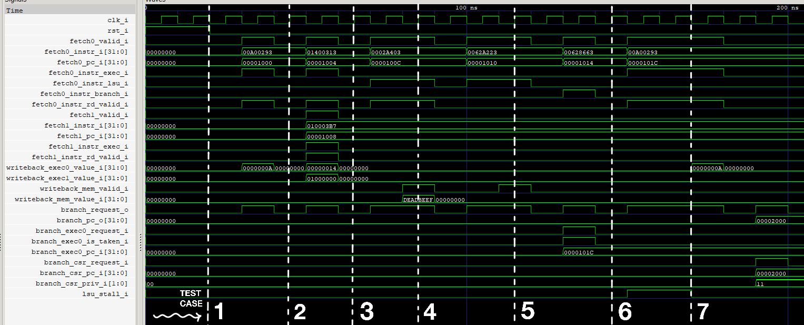
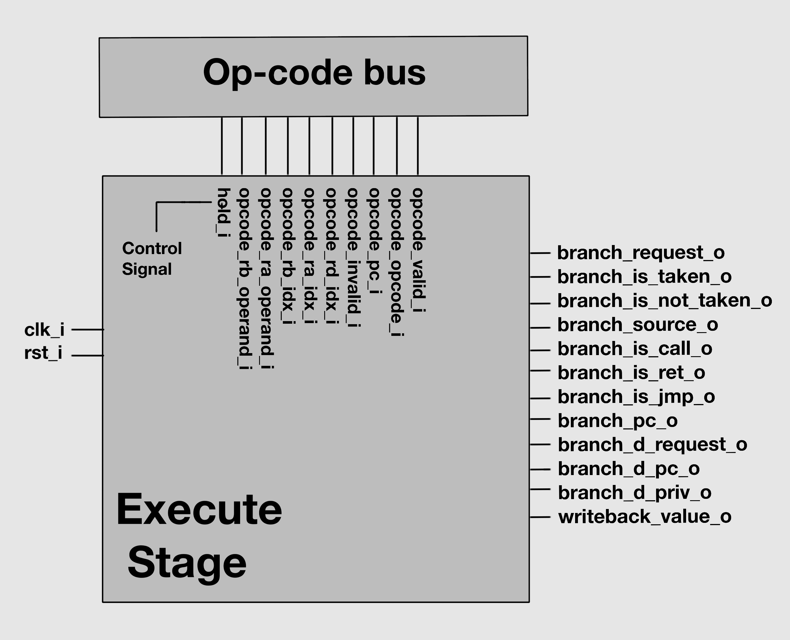
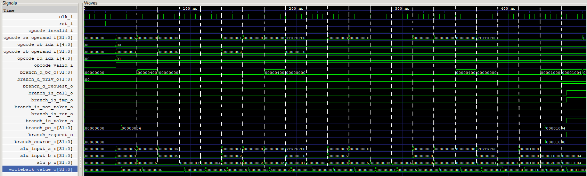
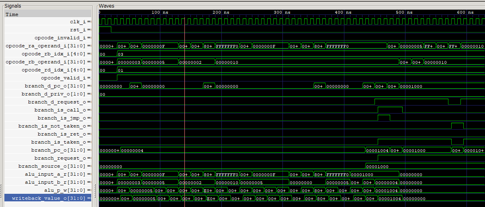

# 🚀 DUAL-CORE-RV32IMZicsr
**PREVIOUS**: https://github.com/hilay020905/RISC_V_CORE

**DUAL-CORE-RV32IMZicsr** is a high-performance, dual-issue, superscalar, in-order 32-bit RISC-V CPU core based on the RV32IMZicsr ISA. Designed for configurable branch prediction, CSR handling, and is fully synthesizable in Verilog-2001.

---

## 🧠 Project Overview

- 🧮 **Architecture**: Dual-issue, 7-stage in-order pipeline
- ⚙️ **ISA**: RV32IMZicsr (Integer, Multiply/Divide, CSR)
- 🚀 **Performance**:
  - 2 instructions per cycle max
- 🔁 **Pipeline**:
  - 64-bit instruction fetch
  - 32-bit data memory access
  - Dual ALUs + LSU + out-of-pipeline Divider.
- 🧠 **Branch Prediction**:
  - Gshare or Bimodal Predictor (configurable)
  - Branch Target Buffer (BTB) + Return Address Stack (RAS)


---

# 📅 12 Days Development Plan

| **Date**   | **Day** | **Module / Task**       | **Testbench** |
| ---------- | ------: | ----------------------- |---------------| 
| 2025-06-23 |   Day 1 | Architecture Planning   | no            |
| 2025-06-24 |   Day 2 | Next PC Logic           | yes           |
| 2025-06-25 |   Day 3 | Fetch unit              | yes           |
| 2025-06-26 |   Day 4 | Decode unit + Decoder   | yes           |
| 2025-06-27 |   Day 5 | ALU DIV MUL             | yes           |
| 2025-06-28 |   Day 6 | LSU                     | yes           |
| 2025-06-29 |   Day 7 | Register file           | no            |
| 2025-06-30 |   Day 8 | Issue unit + Pipe ctrl  | yes           |
| 2025-07-01 |   Day 9 | Execute unit            | yes           |
| 2025-07-02 |  Day 10 | CSR                     | no            |
| 2025-07-03 |  Day 11 | MMU                     | no            |
| 2025-07-04 |  Day 12 | Top (RISCV_CORE)        | no           |

## Architecture Planning


# Microarchitecture
## NEXT PC LOGIC (Configurable with or without branch prediction)

This module evaluates the **Next Program Counter (PC) Prediction** unit for a RISC-V CPU with branch prediction support using:

- **BTB** (Branch Target Buffer) Remembers where a branch instruction goes (target address). Used to predict the destination of jumps, calls, and branches.
- **BHT** (Branch History Table) Predicts whether a branch is taken or not taken. Uses past behavior to guide future predictions.
- **RAS** (Return Address Stack) Predicts return addresses for function returns (ret). Stores return PCs from call instructions in a stack-like structure.

.png)
.png)


| Test Case | Inputs Activated                                                 | Output PC (`next_pc_f_o`) | Prediction (`next_taken_f_o`) | Explanation                                                |
| --------- | ---------------------------------------------------------------- | ------------------------- | ----------------------------- | ---------------------------------------------------------- |
| 1         | None                                                             | `00001008`                | `00`                          | Sequential fetch (`pc + 8`), no BTB prediction.            |
| 2         | `branch_request_i`, `branch_is_taken_i`                          | Updates BTB               | `00`                          | Real branch taken, updates BTB for next predictions.       |
| 3         | `pc_accept_i`                                                    | `00002000`                | `01`                          | BTB predicts branch from Test 2, correct prediction.       |
| 4         | `branch_request_i`, `branch_is_call_i`                           | Updates RAS               | `01`                          | Function call, pushes return address to RAS.               |
| 5         | `branch_request_i`, `branch_is_ret_i`                            | `00002000`                | `01`                          | Return predicted using RAS stack (correctly).              |
| 6         | `branch_request_i`, `branch_is_not_taken_i`                      | Updates BHT               | `01`                          | Not-taken branch trains BHT to avoid future mispredict.    |
| 7         | `branch_request_i`, `branch_is_jmp_i`                            | Updates BTB               | `01`                          | Jump instruction predicted by BTB.                         |
| 8         | `invalidate_i` pulse                                             | `00002000`                | `01`                          | Prediction structures invalidated; no visible change.      |
| 9         | `branch_request_i`, `branch_is_taken_i`, `branch_is_not_taken_i` | `00002000`                | `01`                          | Simulates dual branch behavior (both taken and not taken). |
| 10        | None                                                             | `00002000`                | `01`                          | Idle, no new input activity.                               |

## Fetch unit
The FETCH module implements the instruction fetch stage of a processor, handling program counter management, branch requests, and instruction cache interactions. It supports optional MMU functionality and manages stalls, faults, and backpressure using a skid buffer.


| **Group**           | **Signal Name**            | **Purpose / Notes**                                 | 
| ------------------- | -------------------------- | --------------------------------------------------- | 
| ⏱️ Clock & Reset    | `clk_i`                    | Main system clock (10ns period)                     | 
|                     | `rst_i`                    | Active-high reset signal                            | 
| ▶️ Input Control    | `fetch_accept_i`           | Downstream fetch unit ready                         | 
|                     | `icache_accept_i`          | Instruction cache accepts read request              | 
|                     | `icache_valid_i`           | Valid instruction data from cache                   | 
|                     | `branch_request_i`         | Trigger branch fetch                                | 
|                     | `fetch_invalidate_i`       | Invalidate fetch (for flushes)                      | 
|                     | `icache_error_i`           | Cache returned error                                | 
|                     | `icache_page_fault_i`      | Cache reported page fault                           | 
| ✅ Output           | `fetch_valid_o`            | Instruction output is valid                         | 
|                     | `fetch_pred_branch_o[1:0]` | Predicted branch decision                           | 
|                     | `fetch_fault_fetch_o`      | Fetch fault (e.g., alignment)                       | 
|                     | `fetch_fault_page_o`       | Page fault occurred during fetch                    | 
|                     | `icache_priv_o[1:0]`       | Privilege level sent to I-cache                     | 
| 🧠 Internal Signals | `active_q`                 | Indicates if fetch stage is active                  |
|                     | `branch_q`                 | Branch state active                                 | 
|                     | `stall_q`                  | Indicates if fetch stage is stalled                 | 
|                     | `skid_valid_q`             | Skid buffer has valid data                          | 


## Decode unit


| **Signal Name**               | **Role**                         | **Importance for Analysis**                                                            |
| ----------------------------- | -------------------------------- | -------------------------------------------------------------------------------------- |
| `fetch_in_valid_i`            | Input Control - Input Valid      | High when instruction pair is valid (e.g., 20 ns, 50 ns); initiates FIFO push.         |
| `fetch_in_accept_o`           | Output Control - Input Accept    | High when FIFO can accept new instructions; confirms buffer availability.              |
| `fetch_out0_valid_o`          | Output Control - Channel 0 Valid | High when channel 0 has a valid instruction (e.g., \~30 ns); signals downstream stage. |
| `fetch_out1_valid_o`          | Output Control - Channel 1 Valid | High when channel 1 has a valid instruction; important for dual-issue pipelines.       |
| `fetch_out0_accept_i`         | Input Control - Channel 0 Accept | High when downstream logic consumes channel 0 instruction; affects FIFO pop.           |
| `fetch_out1_accept_i`         | Input Control - Channel 1 Accept | High when downstream logic consumes channel 1 instruction.                             |
| `fetch_in_instr_i[63:0]`      | Input - Instruction Pair         | Contains 2x32-bit instructions; analyzed to verify opcodes (e.g., `LW`, `ADDI`).       |
| `fetch_in_pc_i[31:0]`         | Input - Program Counter          | Aligned base PC (e.g., `0x1000`); helps validate correct PC tracking.                  |
| `fetch_in_pred_branch_i[1:0]` | Input - Predicted Branch         | Indicates expected control flow path (affects output channel validity).                |
| `fetch_in_fault_fetch_i`      | Input - Fetch Fault              | High triggers fault handling logic (e.g., Test 5); propagates to CSR/fault status.     |
| `fetch_in_fault_page_i`       | Input - Page Fault               | Monitors memory page access errors; reserved for fault management.                     |
| `branch_request_i`            | Input - Branch Request           | High flushes the FIFO (e.g., at 170 ns in Test 6); ensures pipeline redirection.       |
| `branch_pc_i[31:0]`           | Input - Branch PC                | New target address on branch (e.g., `0x2000`); used to restart fetch.                  |
| `branch_priv_i[1:0]`          | Input - Branch Privilege         | Indicates privilege level (e.g., machine mode); required for CSR/memory access.        |

🔀 Output: Channel 0
| **Signal**                    | **Role**             | **Importance**                                              |
| ----------------------------- | -------------------- | ----------------------------------------------------------- |
| `fetch_out0_instr_o[31:0]`    | Instruction          | Contains decoded instruction (e.g., `0x00100093` = `ADDI`). |
| `fetch_out0_pc_o[31:0]`       | Program Counter      | PC of channel 0 instruction (e.g., `0x1000`).               |
| `fetch_out0_instr_exec_o`     | ALU Operation        | High for arithmetic/logic ops (e.g., `ADDI`).               |
| `fetch_out0_instr_lsu_o`      | Load/Store Operation | High for memory ops (e.g., `LW`).                           |
| `fetch_out0_instr_branch_o`   | Branch Operation     | High if instruction is `JAL`, `BEQ`, etc.                   |
| `fetch_out0_instr_mul_o`      | Multiplication       | High when `MUL` detected (Test 3).                          |
| `fetch_out0_instr_div_o`      | Division             | High if `DIV` detected (monitored only).                    |
| `fetch_out0_instr_csr_o`      | CSR/System Operation | High for `CSRRW`, `CSRRS`, or fault-based system ops.       |
| `fetch_out0_instr_rd_valid_o` | Register Write       | High if instruction writes to `rd` (e.g., `ADDI`, `JAL`).   |
| `fetch_out0_instr_invalid_o`  | Invalid Instruction  | High for illegal encodings (e.g., `0xFFFFFFFF` in Test 4).  |
| `fetch_out0_fault_fetch_o`    | Fetch Fault          | Indicates instruction fetch fault propagated.               |
| `fetch_out0_fault_page_o`     | Page Fault           | Page-level fault status (monitored only).                   |

🔀 Output: Channel 1
| **Signal**                    | **Role**             | **Importance**                                   |
| ----------------------------- | -------------------- | ------------------------------------------------ |
| `fetch_out1_instr_o[31:0]`    | Instruction          | Decoded instruction (e.g., `0x00020083` = `LW`). |
| `fetch_out1_pc_o[31:0]`       | Program Counter      | PC of channel 1 instruction (e.g., `0x1004`).    |
| `fetch_out1_instr_exec_o`     | ALU Operation        | ALU instruction decoder flag (e.g., `ADDI`).     |
| `fetch_out1_instr_lsu_o`      | Load/Store Operation | High for `LW`, `SW`, etc.                        |
| `fetch_out1_instr_branch_o`   | Branch Operation     | High if branch (`BEQ`) present.                  |
| `fetch_out1_instr_mul_o`      | Multiplication       | Monitored (not tested).                          |
| `fetch_out1_instr_div_o`      | Division             | Monitored (not tested).                          |
| `fetch_out1_instr_csr_o`      | CSR/System Operation | High on `CSR` instructions or faults.            |
| `fetch_out1_instr_rd_valid_o` | Register Write       | High if `rd` is written.                         |
| `fetch_out1_instr_invalid_o`  | Invalid Instruction  | Illegal opcodes (if present).                    |
| `fetch_out1_fault_fetch_o`    | Fetch Fault          | Fault detected on fetch for channel 1.           |
| `fetch_out1_fault_page_o`     | Page Fault           | Memory page fault flag (monitored).              |


The testbench includes **six unit tests**, each targeting specific decode logic behavior:

### ✅ Test Cases:

1. **Test 1 – Valid Instructions**
   - Inputs: `ADDI` and `LW`
   - ✅ Tests ALU and load/store decoding logic.

2. **Test 2 – Branch Instruction with Prediction**
   - Input: `JAL` with predicted branch
   - ✅ Tests branch decoding and prediction path handling.

3. **Test 3 – Multiply Instruction**
   - Input: `MUL` (requires `SUPPORT_MULDIV = 1`)
   - ✅ Validates MULDIV instruction decoding.

4. **Test 4 – Invalid Instruction**
   - Input: `0xFFFFFFFF`
   - ✅ Detects illegal instructions; sets invalid flag.

5. **Test 5 – Fetch Fault**
   - Condition: `fetch_fault` set high
   - ✅ Verifies fault handling and propagation logic.

6. **Test 6 – Branch Flush & CSR**
   - Sequence: `branch_request_i`, then `CSRRW` and `BEQ`
   - ✅ Tests pipeline flush behavior, CSR, and branch decode after redirection.


## ALU DIV MUL

| Operation               | Inputs                                                 | Expected Result                          | Actual Result                  | Notes                                                     |
| ----------------------- | ------------------------------------------------------ | ---------------------------------------- | ------------------------------ | --------------------------------------------------------- |
| ADD (`ALU_ADD`)         | `alu_a_i = 0xA (10)`, `alu_b_i = 0x5 (5)`              | `alu_p_o = 0xF (15)`                     | `alu_p_o = 0xF`                | Addition: 10 + 5 = 15                                     |
| SUB (`ALU_SUB`)         | `alu_a_i = 0xA (10)`, `alu_b_i = 0x5 (5)`              | `alu_p_o = 0x5 (5)`                      | `alu_p_o = 0x5`                | Subtraction: 10 - 5 = 5                                   |
| SHIFTL (`ALU_SHIFTL`)   | `alu_a_i = 0x1 (1)`, `alu_b_i = 0x2 (2)`               | `alu_p_o = 0x4 (4)`                      | `alu_p_o = 0x4`                | Left shift: 1 << 2 = 4                                    |
| SHIFTR\_ARITH           | `alu_a_i = 0x80000000 (-2³¹)`, `alu_b_i = 0x1 (1)`     | `alu_p_o = 0xC0000000 (-2³⁰)`            | `alu_p_o = 0xC0000000`         | Arithmetic right shift: -2³¹ >> 1 = -2³⁰                  |
| AND (`ALU_AND`)         | `alu_a_i = 0xFF (255)`, `alu_b_i = 0xF (15)`           | `alu_p_o = 0xF (15)`                     | `alu_p_o = 0xF`                | Bitwise AND: 255 & 15 = 15                                |
| LT\_SIGNED (`ALU_LT_S`) | `alu_a_i = 0xFFFFFFFE (-2)`, `alu_b_i = 0x1 (1)`       | `alu_p_o = 0x1 (1)`                      | `alu_p_o = 0x1`                | Signed comparison: -2 < 1 → 1                             |
| MUL (`INST_MUL`)        | `opcode_ra = 0xA (10)`, `opcode_rb = 0x3 (3)`          | `writeback_value = 0x1E (30)`            | `writeback_value = 0x1E`       | Multiplication: 10 × 3 = 30 (3 cycles ≈ 30 ns)            |
| MULH (`INST_MULH`)      | `opcode_ra = 0x80000000 (-2³¹)`, `opcode_rb = 0x2 (2)` | `writeback_value = 0xFFFFFFFF (-1)`      | `writeback_value = 0xFFFFFFFF` | High 32 bits of signed mult: (-2³¹) × 2 = 0x1\_0000\_0000 |


## LSU

| Test Case | Description                             | Purpose                                            | Input Stimuli (Key Signals)                                                                                                                                                                  | Expected Outputs (Key Signals)                                                                                                                                                            |
|-----------|-----------------------------------------|----------------------------------------------------|---------------------------------------------------------------------------------------------------------------------------------------------------------------------------------------------|-------------------------------------------------------------------------------------------------------------------------------------------------------------------------------------------|
| **1**: Load Byte (LB) - Aligned | Load byte from aligned address                  | Verify correct byte extraction; no exception       | `opcode_valid_i=1`, `opcode_opcode_i=INST_LB (0x3)`, `opcode_ra_operand_i=0x1000`, `mem_data_rd_i=0xDEADBEEF`, `mem_ack_i=1 (after 10ns)`                                                  | `mem_addr_o=0x1000`, `mem_rd_o=1`, `writeback_valid_o=1`, `writeback_value_o=0xEF`, `writeback_exception_o=0x0`, `stall_o=0`                                                              |
| **2**: Store Word (SW) - Aligned | Store word to aligned address                  | Verify data and full byte mask                     | `opcode_valid_i=1`, `opcode_opcode_i=INST_SW (0x2023)`, `opcode_ra_operand_i=0x2000`, `opcode_rb_operand_i=0xCAFEBABE`, `mem_ack_i=1 (after 10ns)`                                         | `mem_addr_o=0x2000`, `mem_data_wr_o=0xCAFEBABE`, `mem_wr_o=4'b1111`, `writeback_valid_o=1`, `writeback_exception_o=0x0`, `stall_o=0`                                                     |
| **3**: Load Halfword (LH) - Unaligned | Load halfword from unaligned address          | Detect unaligned access; trigger exception         | `opcode_valid_i=1`, `opcode_opcode_i=INST_LH (0x1003)`, `opcode_ra_operand_i=0x3001`                                                                                                       | `mem_rd_o=0`, `writeback_valid_o=1`, `writeback_value_o=0x3001`, `writeback_exception_o=0x14`, `stall_o=1`                                                                                |
| **4**: DCache Flush                        | CSRRW with CSR_DFLUSH                          | Trigger DCache flush signal                         | `opcode_valid_i=1`, `opcode_opcode_i=(CSR_DFLUSH<<20)=0x3a01073`, `opcode_ra_operand_i=0x4000`, `mem_ack_i=1 (after 10ns)`                                                                 | `mem_flush_o=1`, `mem_cacheable_o=1`, `writeback_valid_o=1`, `writeback_exception_o=0x0`                                                                                                 |
| **5**: Load Byte with Bus Error            | Load byte with simulated page/bus fault       | Handle exception correctly                         | `opcode_valid_i=1`, `opcode_opcode_i=INST_LB (0x3)`, `opcode_ra_operand_i=0x5000`, `mem_ack_i=1`, `mem_error_i=1`, `mem_load_fault_i=1 (after 10ns)`                                      | `mem_rd_o=1`, `writeback_valid_o=1`, `writeback_value_o=0x5000`, `writeback_exception_o=0x15` or `0x1D`, `stall_o=0`                                                                      |
| **6**: Store Halfword (SH) - Aligned       | Store halfword to aligned address             | Verify data and halfword mask                      | `opcode_valid_i=1`, `opcode_opcode_i=INST_SH (0x1023)`, `opcode_ra_operand_i=0x6000`, `opcode_rb_operand_i=0x0000BEEF`, `mem_ack_i=1 (after 10ns)`                                         | `mem_addr_o=0x6000`, `mem_data_wr_o=0x0000BEEF`, `mem_wr_o=4'b0011`, `writeback_valid_o=1`, `writeback_exception_o=0x0`, `stall_o=0`                                                     |
| **7**: DCache Invalidate                  | CSRRW with CSR_DINVALIDATE                   | Trigger DCache invalidate signal                   | `opcode_valid_i=1`, `opcode_opcode_i=(CSR_DINVALIDATE<<20)=0x3a21073`, `opcode_ra_operand_i=0x7000`, `mem_ack_i=1 (after 10ns)`                                                            | `mem_invalidate_o=1`, `mem_cacheable_o=1`, `writeback_valid_o=1`, `writeback_exception_o=0x0`                                                                                            |


## Issue unit


| **Signal Category** | **Signal Name**             | **Description**                                                                 |
|---------------------|-----------------------------|---------------------------------------------------------------------------------|
| Fetch Stage         | fetch0_valid_i              | Indicates valid instruction in fetch0 stage                                    |
|                     | fetch0_instr_i              | Instruction data for fetch0                                                    |
|                     | fetch0_pc_i                 | Program counter for fetch0 instruction                                         |
|                     | fetch0_instr_exec_i         | Indicates fetch0 instruction is executable (ALU)                               |
|                     | fetch0_instr_lsu_i          | Indicates fetch0 instruction is LSU (load/store)                               |
|                     | fetch0_instr_branch_i       | Indicates fetch0 instruction is a branch                                       |
|                     | fetch0_instr_rd_valid_i     | Indicates fetch0 instruction writes to a register                              |
|                     | fetch1_valid_i              | Indicates valid instruction in fetch1 stage (dual issue)                       |
|                     | fetch1_instr_i              | Instruction data for fetch1                                                    |
|                     | fetch1_pc_i                 | Program counter for fetch1 instruction                                         |
|                     | fetch1_instr_exec_i         | Indicates fetch1 instruction is executable (ALU)                               |
|                     | fetch1_instr_rd_valid_i     | Indicates fetch1 instruction writes to a register                              |
| Pipeline Outputs    | exec0_opcode_valid_o        | Indicates valid opcode issued to EXEC0 unit                                    |
|                     | opcode0_opcode_o            | Opcode issued to EXEC0 unit                                                    |
|                     | opcode0_pc_o                | PC of opcode issued to EXEC0                                                   |
|                     | opcode0_rd_idx_o            | Destination register index for EXEC0                                           |
|                     | opcode0_ra_operand_o        | Operand A for EXEC0                                                            |
|                     | opcode0_rb_operand_o        | Operand B for EXEC0                                                            |
|                     | exec1_opcode_valid_o        | Indicates valid opcode issued to EXEC1 unit                                    |
|                     | opcode1_opcode_o            | Opcode issued to EXEC1 unit                                                    |
|                     | opcode1_rd_idx_o            | Destination register index for EXEC1                                           |
|                     | lsu_opcode_valid_o          | Indicates valid opcode issued to LSU unit                                      |
|                     | lsu_opcode_opcode_o         | Opcode issued to LSU unit                                                      |
|                     | lsu_opcode_rd_idx_o         | Destination register index for LSU                                             |
|                     | lsu_opcode_ra_operand_o     | Operand A for LSU (base address)                                               |
| Writeback           | writeback_exec0_value_i     | Writeback value from EXEC0 unit                                                |
|                     | writeback_exec1_value_i     | Writeback value from EXEC1 unit                                                |
|                     | writeback_mem_valid_i       | Indicates valid memory writeback                                               |
|                     | writeback_mem_value_i       | Writeback value from memory (LSU)                                              |
| Branch Control      | branch_request_o            | Indicates a branch request                                                     |
|                     | branch_pc_o                 | Target PC for branch                                                           |
|                     | branch_exec0_request_i      | Branch request from EXEC0                                                      |
|                     | branch_exec0_is_taken_i     | Indicates branch taken for EXEC0                                               |
|                     | branch_exec0_pc_i           | Branch target PC from EXEC0                                                    |
|                     | branch_csr_request_i        | CSR branch request (e.g., for interrupts)                                      |
|                     | branch_csr_pc_i             | CSR branch target PC                                                           |
|                     | branch_csr_priv_i           | Privilege level for CSR branch                                                 |
| Pipeline Control    | exec0_hold_o                | Indicates EXEC0 pipeline hold                                                  |
|                     | lsu_stall_i                 | LSU stall input                                                                |
|                     | interrupt_inhibit_o         | Indicates interrupts are inhibited                                             |
| TRACE_SIM           | dut.dbg_inst_str            | Decoded instruction string (ASCII)                                             |
|                     | dut.dbg_inst_ra             | Source register A value                                                        |
|                     | dut.dbg_inst_rd             | Destination register value                                                     |
| Register File       | dut.register_file_inst.rf[0:31] | Register file contents (x0 to x31)                                         |




## Execute unit



Following 29 testcases were tested:

| Test # | Instruction | Opcode     | Inputs                                    | writeback_value_o | branch_request_o | branch_is_taken_o | branch_is_not_taken_o | branch_pc_o |
|--------|-------------|------------|-------------------------------------------|-------------------|------------------|--------------------|------------------------|--------------|
| 1      | ADD         | 0x00000033 | ra=0x5, rb=0x3                             | 0x00000008        | 0                | 0                  | 0                      | 0x00000004   |
| 2      | SUB         | 0x40000033 | ra=0x8, rb=0x3                             | 0x00000005        | 0                | 0                  | 0                      | 0x00000004   |
| 3      | AND         | 0x00007033 | ra=0xF, rb=0x5                             | 0x00000005        | 0                | 0                  | 0                      | 0x00000004   |
| 4      | OR          | 0x00006033 | ra=0xF, rb=0x5                             | 0x0000000F        | 0                | 0                  | 0                      | 0x00000004   |
| 5      | XOR         | 0x00004033 | ra=0xF, rb=0x5                             | 0x0000000A        | 0                | 0                  | 0                      | 0x00000004   |
| 6      | SLL         | 0x00001033 | ra=0x1, rb=0x2                             | 0x00000004        | 0                | 0                  | 0                      | 0x00000004   |
| 7      | SRL         | 0x00005033 | ra=0x8, rb=0x2                             | 0x00000002        | 0                | 0                  | 0                      | 0x00000004   |
| 8      | SRA         | 0x40005033 | ra=0x80000008, rb=0x2                      | 0xE0000002        | 0                | 0                  | 0                      | 0x00000004   |
| 9      | SLT         | 0x00002033 | ra=0xFFFFFFF0 (-16), rb=0x10 (16)          | 0x00000001        | 0                | 0                  | 0                      | 0x00000004   |
| 10     | SLTU        | 0x00003033 | ra=0xFFFFFFF0, rb=0x10                     | 0x00000000        | 0                | 0                  | 0                      | 0x00000004   |
| 11     | ADDI        | 0x00500013 | ra=0x3, imm=0x5                            | 0x00000008        | 0                | 0                  | 0                      | 0x00000004   |
| 12     | ANDI        | 0x00507013 | ra=0xF, imm=0x5                            | 0x00000005        | 0                | 0                  | 0                      | 0x00000004   |
| 13     | ORI         | 0x00506013 | ra=0xF, imm=0x5                            | 0x0000000F        | 0                | 0                  | 0                      | 0x00000004   |
| 14     | XORI        | 0x00504013 | ra=0xF, imm=0x5                            | 0x0000000A        | 0                | 0                  | 0                      | 0x00000004   |
| 15     | SLLI        | 0x00002013 | ra=0x1, shamt=0x2                          | 0x00000004        | 0                | 0                  | 0                      | 0x00000004   |
| 16     | SRLI        | 0x00005013 | ra=0x8, shamt=0x2                          | 0x00000002        | 0                | 0                  | 0                      | 0x00000004   |
| 17     | SRAI        | 0x40005013 | ra=0x80000008, shamt=0x2                   | 0xE0000002        | 0                | 0                  | 0                      | 0x00000004   |
| 18     | SLTI        | 0x00502013 | ra=0xFFFFFFF0 (-16), imm=0x5               | 0x00000001        | 0                | 0                  | 0                      | 0x00000004   |
| 19     | SLTIU       | 0x00503013 | ra=0xFFFFFFF0, imm=0x5                     | 0x00000000        | 0                | 0                  | 0                      | 0x00000004   |
| 20     | LUI         | 0x00001037 | imm20=0x1                                  | 0x00001000        | 0                | 0                  | 0                      | 0x00000004   |
| 21     | AUIPC       | 0x00001017 | pc=0x1000, imm20=0x1                       | 0x00002000        | 0                | 0                  | 0                      | 0x00000004   |
| 22     | JAL         | 0x0040006F | pc=0x1000, imm=0x4, rd=ra                  | 0x00001004        | 1                | 1                  | 0                      | 0x00001004   |
| 23     | JALR        | 0x00008067 | ra=0x2000, imm=0x0, rd=ra                  | 0x00001004        | 1                | 1                  | 0                      | 0x00002000   |
| 24     | BEQ         | 0x00008063 | ra=0x5, rb=0x5, pc=0x1000, imm=0x8         | 0x00000000        | 1                | 1                  | 0                      | 0x00001008   |
| 25     | BNE         | 0x00009063 | ra=0x5, rb=0x6, pc=0x1000, imm=0x8         | 0x00000000        | 1                | 1                  | 0                      | 0x00001008   |
| 26     | BLT         | 0x0000C063 | ra=0xFFFFFFF0 (-16), rb=0x10, imm=0x8      | 0x00000000        | 1                | 1                  | 0                      | 0x00001008   |
| 27     | BGE         | 0x0000D063 | ra=0x10, rb=0x10, imm=0x8                  | 0x00000000        | 1                | 1                  | 0                      | 0x00001008   |
| 28     | BLTU        | 0x0000E063 | ra=0xFFFFFFF0, rb=0x10, imm=0x8            | 0x00000000        | 1                | 1                  | 0                      | 0x00001008   |
| 29     | BGEU        | 0x0000F063 | ra=0x10, rb=0x10, imm=0x8                  | 0x00000000        | 1                | 1                  | 0                      | 0x00001008   |





### 🔧 Prerequisites
- iVerilog
- GTKWave
- verilator

### 🔨 Build & Run

```bash
# Clone the repository
git clone https://github.com/hilay0200905/RV32IMZicsr.git
cd RV32IMZicsr
```

👨‍💻 Author
Hilay Patel

🎓 [Indian institue of technology, Tirupati]

📧 ee23b066@iittp.ac.in

🌐 [LinkedIn Profile: www.linkedin.com/in/hilay-patel-84a052286]

Thank you for exploring this project! Feel free to fork, use, or contribute. PRs are welcome!🙌

